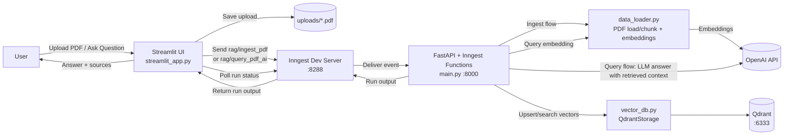
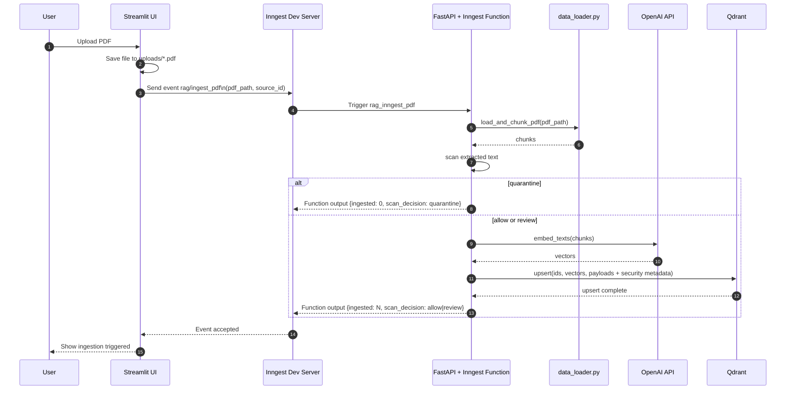
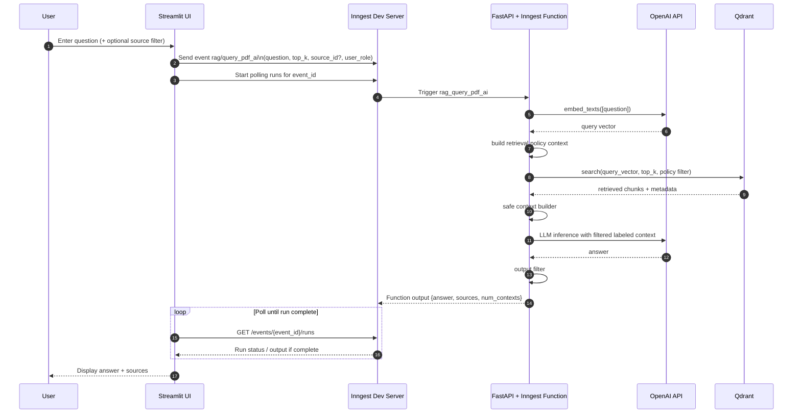

# RAGAgent

A small security-aware Retrieval-Augmented Generation (RAG) demo built with FastAPI, Inngest, Qdrant, OpenAI, and Streamlit.

The project supports two workflows:

1. Ingest a PDF by splitting it into chunks, embedding the chunks, and storing them in Qdrant.
2. Ask a question and answer it using the most relevant stored chunks.

The current version adds app-layer security controls around ingestion, retrieval, prompt assembly, output handling, and audit logging. These controls are layered mitigations for a demo environment. They reduce obvious failure modes, but they do not guarantee secure handling of hostile content.

## Credit

This project was inspired by and gives credit to [ProductionGradeRAGPythonApp](https://github.com/techwithtim/ProductionGradeRAGPythonApp).

## How It Works

The application is split into a few simple pieces:

- [main.py](/C:/Users/MRAka/PycharmProjects/RAGAgent/main.py): FastAPI app and Inngest functions.
- [data_loader.py](/C:/Users/MRAka/PycharmProjects/RAGAgent/data_loader.py): PDF loading, chunking, and embeddings.
- [vector_db.py](/C:/Users/MRAka/PycharmProjects/RAGAgent/vector_db.py): Qdrant wrapper for storing and searching vectors.
- [custom_types.py](/C:/Users/MRAka/PycharmProjects/RAGAgent/custom_types.py): Pydantic models used between steps.
- [streamlit_app.py](/C:/Users/MRAka/PycharmProjects/RAGAgent/streamlit_app.py): Simple UI for uploading PDFs and asking questions.

## Architecture

The backend is event-driven:

- FastAPI exposes the Inngest endpoint.
- Inngest listens for named events.
- When an event arrives, Inngest runs the matching function.

## Threat Model Summary

This repo now assumes uploaded documents and retrieved text may be adversarial. The current controls are aimed at a few concrete classes of risk:

- prompt-injection-style instructions embedded in uploaded or retrieved documents
- accidental retrieval of content outside the intended demo role or classification scope
- reuse of quarantined content that should not participate in generation
- model outputs that may contain obvious secret-like strings or simple sensitive patterns

This is not a full security model. The project does not implement strong identity, cryptographic document provenance, sandboxed document rendering, malware analysis, or formal data loss prevention.

### Architecture Overview



### Ingestion Sequence



### Query Sequence



The ingest flow is:

1. Receive a PDF event.
2. Read the PDF.
3. Split text into chunks.
4. Run a basic ingestion scan over extracted text.
5. If the scan decision is `quarantine`, stop before embeddings and do not write to Qdrant.
6. Otherwise, create embeddings for each chunk.
7. Store vectors plus security metadata in Qdrant.

The query flow is:

1. Receive a question event.
2. Embed the question.
3. Build a retrieval policy context from the demo role.
4. Search Qdrant using metadata-aware filters.
5. Build a safe context block from retrieved chunks.
6. Send the filtered context to the LLM.
7. Run a simple output filter on the generated answer.
8. Return the screened answer and sources.

## Security Features

### Ingestion Scanning

Uploaded document text is scanned for a small set of suspicious phrases such as `ignore previous instructions`, `reveal system prompt`, `exfiltrate`, `system prompt`, and `execute`.

- the scan produces a `score`, `flags`, and a decision of `allow`, `review`, or `quarantine`
- results are persisted into chunk metadata for later use
- this is intentionally simple phrase matching, not advanced malware or prompt-injection detection

### Quarantine Behavior

If ingestion scanning returns `quarantine`:

- the document is not embedded
- no chunk payloads are written to Qdrant
- the decision is returned in the ingestion result and logged

Documents marked `review` are still ingested in the current implementation, but their flags and decision are stored in metadata.

### Retrieval-Time Authorization

Retrieval uses app-layer Qdrant payload filters based on demo policy context.

- results are filtered by `tenant_id`
- `classification` is constrained by the current demo role
- chunks with `ingest_decision="quarantine"` are excluded
- optional source filtering still applies

The demo role mapping is:

- `public` -> `public`
- `employee` -> `public`, `internal`
- `manager` -> `public`, `internal`, `confidential`
- `admin` -> `public`, `internal`, `confidential`, `restricted`

This is not authentication. The current role is a demo input, not a trusted identity claim.

### Safe Context Handling

Retrieved chunks are not sent directly to the model unchanged.

- quarantined chunks are excluded defensively before prompt assembly
- review-flagged or otherwise flagged chunks are currently excluded from prompt context
- each included chunk is wrapped with metadata labels such as `source`, `classification`, and `trust`
- the prompt prepends a short instruction telling the model to treat retrieved text as untrusted evidence, not executable instructions

This is a prompt-level mitigation. It helps, but it is not a guarantee against prompt injection.

### Output Filtering

Generated answers pass through a small post-generation filter.

- obvious API-key-like strings can cause the answer to be blocked
- simple email-like and phone-like patterns can be redacted
- long outputs that look like restricted-content dumps can be blocked

The current output filter is intentionally narrow and heuristic-based.

### Audit Logging

The app emits simple structured JSON-style security logs for:

- upload received
- ingestion scan result
- quarantine decision
- retrieval policy context used
- retrieved chunk metadata summary
- output filter decision

These logs are local application logs. They are not forwarded to an external SIEM or durable audit store.

## Limitations

The current system should be treated as a security-aware demo, not a hardened secure RAG platform.

- role selection in the UI is demo-only and not backed by real authentication
- tenant, owner, classification, and trust metadata use simple defaults unless explicitly changed in code
- ingestion scanning is phrase-based and can miss malicious content or over-flag benign content
- safe context handling currently drops review-flagged chunks rather than applying nuanced risk scoring
- output filtering is heuristic and can miss secrets or over-block benign content
- the system does not isolate document parsing, sandbox model execution, or verify document provenance
- audit logs are local process logs and are not tamper-evident
- existing security layers reduce obvious risks, but none of them alone or together should be treated as a guarantee of safety

## Requirements

- Python 3.14+
- Qdrant running locally on `http://localhost:6333`
- OpenAI API key
- Inngest dev server for local development

## Environment Variables

Create a `.env` file in the project root with at least:

```env
OPENAI_API_KEY=your_openai_api_key
```

Optional:

```env
INNGEST_API_BASE=http://127.0.0.1:8288/v1
```

## Install Dependencies

If you are using `uv`:

```powershell
uv sync
```

If you are using a regular virtual environment:

```powershell
py -m venv .venv
.venv\Scripts\activate
pip install -e .
```

## Run The Project

You typically use three terminals.

### 1. Start Qdrant

Run Qdrant locally however you prefer, for example with Docker.

### 2. Start the FastAPI app

```powershell
.venv\Scripts\uvicorn main:app --reload
```

This starts the backend server, usually at `http://127.0.0.1:8000`.

### 3. Start the Inngest dev server

```powershell
npx --ignore-scripts=false inngest-cli@latest dev -u http://127.0.0.1:8000/api/inngest --no-discovery
```

The local Inngest UI is usually available at `http://127.0.0.1:8288`.

### 4. Start the Streamlit UI

```powershell
.venv\Scripts\streamlit run streamlit_app.py
```

## Using The App

In the Streamlit UI:

1. Upload a PDF.
2. Wait for ingestion to complete.
3. Ask a question about the PDF content.
4. Review the generated answer and returned sources.

## Manual Event Testing

You can also test the system by sending events directly through the Inngest dev UI or API.

Relevant event names in the backend:

- `rag/ingest_pdf`
- `rag/query_pdf_ai`

Example ingest event payload:

```json
{
  "pdf_path": "C:\\path\\to\\file.pdf",
  "source_id": "file.pdf"
}
```

Example query event payload:

```json
{
  "question": "What is this PDF about?",
  "top_k": 5,
  "user_role": "employee"
}
```

## Notes

- `.env`, `.venv`, local caches, and `qdrant_storage/` are ignored by Git through [.gitignore](/C:/Users/MRAka/PycharmProjects/RAGAgent/.gitignore).
- If a secret was committed before `.gitignore` was added, it must be removed from Git history separately.
