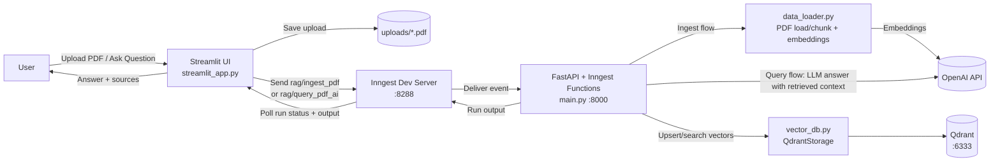
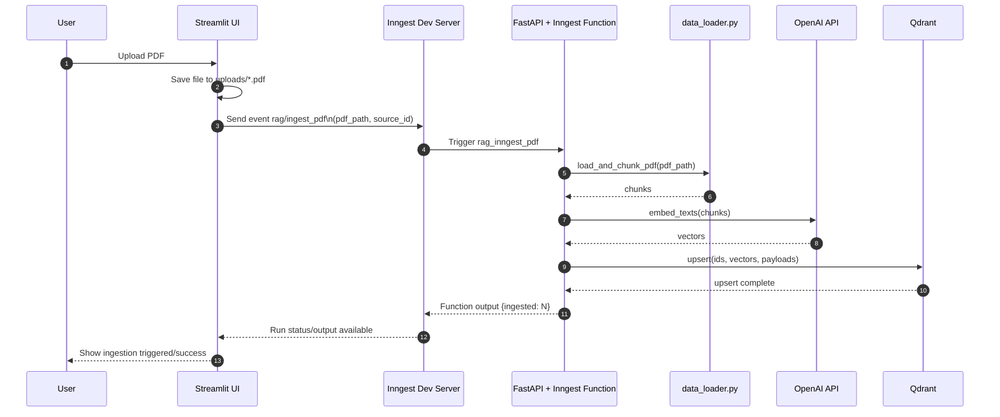
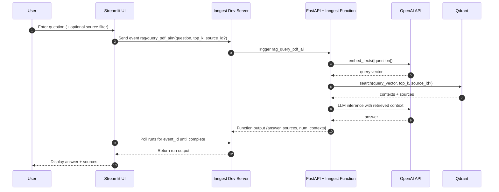

# RAGAgent

A small Retrieval-Augmented Generation (RAG) demo built with FastAPI, Inngest, Qdrant, OpenAI, and Streamlit.

The project supports two workflows:

1. Ingest a PDF by splitting it into chunks, embedding the chunks, and storing them in Qdrant.
2. Ask a question and answer it using the most relevant stored chunks.

## Credit

This project was inspired by and gives credit to [ProductionGradeRAGPythonApp](https://github.com/techwithtim/ProductionGradeRAGPythonApp).

## How It Works

The application is split into a few simple pieces:

- [main.py](/C:/Users/MRAka/PycharmProjects/RAGAgent/main.py): FastAPI app and Inngest functions.
- [data_loader.py](/C:/Users/MRAka/PycharmProjects/RAGAgent/data_loader.py): PDF loading, chunking, and embeddings.
- [vector_db.py](/C:/Users/MRAka/PycharmProjects/RAGAgent/vector_db.py): Qdrant wrapper for storing and searching vectors.
- [custom_types.py](/C:/Users/MRAka/PycharmProjects/RAGAgent/custom_types.py): Pydantic models used between steps.
- [streamlit_app.py](/C:/Users/MRAka/PycharmProjects/RAGAgent/streamlit_app.py): Simple UI for uploading PDFs and asking questions.

## Architecture

The backend is event-driven:

- FastAPI exposes the Inngest endpoint.
- Inngest listens for named events.
- When an event arrives, Inngest runs the matching function.

### Architecture Overview



### Ingestion Sequence



### Query Sequence



The ingest flow is:

1. Receive a PDF event.
2. Read the PDF.
3. Split text into chunks.
4. Create embeddings for each chunk.
5. Store vectors plus metadata in Qdrant.

The query flow is:

1. Receive a question event.
2. Embed the question.
3. Search Qdrant for similar chunks.
4. Send the retrieved context to the LLM.
5. Return the answer and sources.

## Requirements

- Python 3.14+
- Qdrant running locally on `http://localhost:6333`
- OpenAI API key
- Inngest dev server for local development

## Environment Variables

Create a `.env` file in the project root with at least:

```env
OPENAI_API_KEY=your_openai_api_key
```

Optional:

```env
INNGEST_API_BASE=http://127.0.0.1:8288/v1
```

## Install Dependencies

If you are using `uv`:

```powershell
uv sync
```

If you are using a regular virtual environment:

```powershell
py -m venv .venv
.venv\Scripts\activate
pip install -e .
```

## Run The Project

You typically use three terminals.

### 1. Start Qdrant

Run Qdrant locally however you prefer, for example with Docker.

### 2. Start the FastAPI app

```powershell
.venv\Scripts\uvicorn main:app --reload
```

This starts the backend server, usually at `http://127.0.0.1:8000`.

### 3. Start the Inngest dev server

```powershell
npx --ignore-scripts=false inngest-cli@latest dev -u http://127.0.0.1:8000/api/inngest --no-discovery
```

The local Inngest UI is usually available at `http://127.0.0.1:8288`.

### 4. Start the Streamlit UI

```powershell
.venv\Scripts\streamlit run streamlit_app.py
```

## Using The App

In the Streamlit UI:

1. Upload a PDF.
2. Wait for ingestion to complete.
3. Ask a question about the PDF content.
4. Review the generated answer and returned sources.

## Manual Event Testing

You can also test the system by sending events directly through the Inngest dev UI or API.

Relevant event names in the backend:

- `rag/ingest_pdf`
- `rag/query_pdf_ai`

Example ingest event payload:

```json
{
  "pdf_path": "C:\\path\\to\\file.pdf",
  "source_id": "file.pdf"
}
```

Example query event payload:

```json
{
  "question": "What is this PDF about?",
  "top_k": 5
}
```

## Notes

- `.env`, `.venv`, local caches, and `qdrant_storage/` are ignored by Git through [.gitignore](/C:/Users/MRAka/PycharmProjects/RAGAgent/.gitignore).
- If a secret was committed before `.gitignore` was added, it must be removed from Git history separately.
