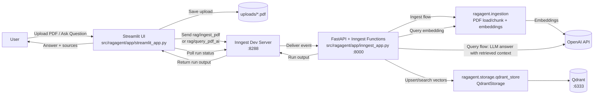
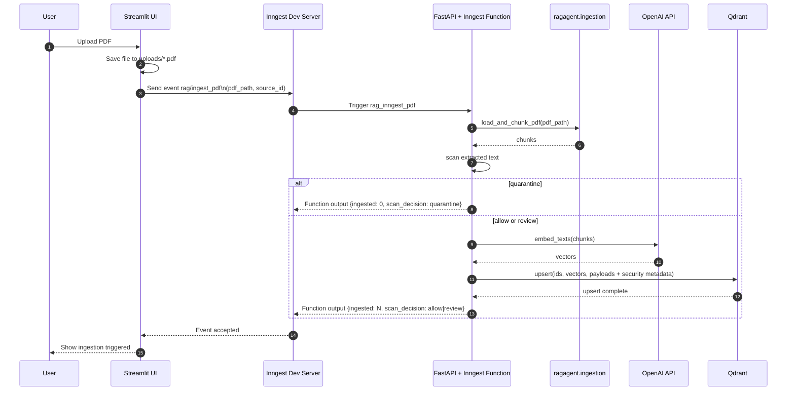
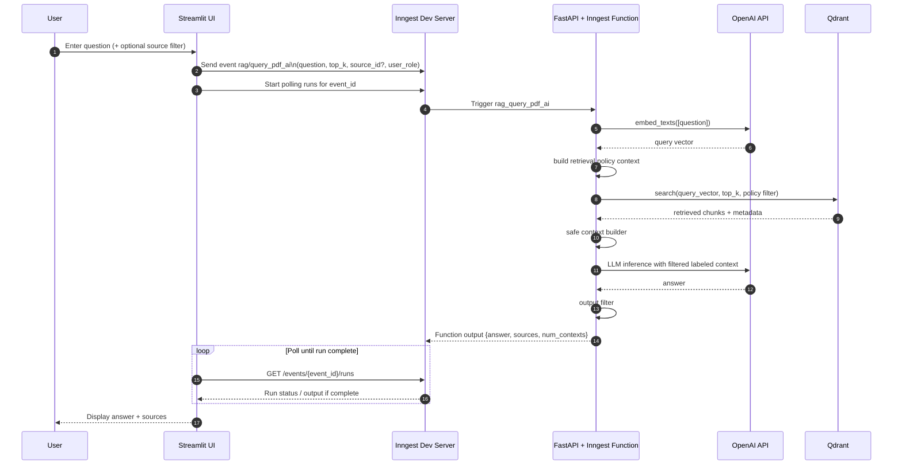

# RAGAgent

A small security-aware Retrieval-Augmented Generation (RAG) demo built with FastAPI, Inngest, Qdrant, OpenAI, and Streamlit.

It demonstrates layered app-level controls around document ingestion, retrieval, prompt context assembly, output screening, and audit logging. It is a demo of defense-in-depth patterns, not a hardened security boundary.

## What This Demonstrates

- PDF ingestion into a vector store
- ingestion-time suspicious-content scanning
- quarantine enforcement before embedding/upsert
- retrieval-time metadata filtering based on demo role policy
- safe prompt context construction from retrieved chunks
- post-generation output screening
- structured security event logging

## Quickstart

Requirements:

- Python 3.14+
- Qdrant running locally on `http://localhost:6333`
- OpenAI API key
- Inngest dev server for local development

Install:

```powershell
py -m venv .venv
.venv\Scripts\activate
.venv\Scripts\python.exe -m pip install -e .
```

Create a `.env` file in the project root:

```env
OPENAI_API_KEY=your_openai_api_key
INNGEST_API_BASE=http://127.0.0.1:8288/v1
```

Run the app:

1. Start Qdrant locally.
2. Start the FastAPI/Inngest app:

```powershell
.venv\Scripts\uvicorn ragagent.app.inngest_app:app --reload
```

3. Start the Inngest dev server:

```powershell
npx --ignore-scripts=false inngest-cli@latest dev -u http://127.0.0.1:8000/api/inngest --no-discovery
```

4. Start Streamlit:

```powershell
.venv\Scripts\streamlit run src/ragagent/app/streamlit_app.py
```

## Testing

Preferred:

```powershell
.venv\Scripts\python.exe -m unittest discover -s tests -t . -p "test_*.py"
```

Compatibility entrypoint:

```powershell
.venv\Scripts\python.exe -m unittest tests.test_security_pipeline
```

## Project Structure

- [src/ragagent/app/](/C:/Users/MRAka/PycharmProjects/RAGAgent/src/ragagent/app): FastAPI/Inngest and Streamlit entrypoints
- [src/ragagent/workflows/](/C:/Users/MRAka/PycharmProjects/RAGAgent/src/ragagent/workflows): ingest and query orchestration
- [src/ragagent/ingestion/](/C:/Users/MRAka/PycharmProjects/RAGAgent/src/ragagent/ingestion): PDF loading, chunking, and embeddings
- [src/ragagent/security/](/C:/Users/MRAka/PycharmProjects/RAGAgent/src/ragagent/security): scanning, policy, safe context handling, output filtering, and audit logging
- [src/ragagent/storage/](/C:/Users/MRAka/PycharmProjects/RAGAgent/src/ragagent/storage): Qdrant access
- [src/ragagent/models/](/C:/Users/MRAka/PycharmProjects/RAGAgent/src/ragagent/models): payload, policy, and result models
- [tests/](/C:/Users/MRAka/PycharmProjects/RAGAgent/tests): unit and integration coverage for the security-aware flow

## Security Pipeline

| Stage | Current Control | Current Behavior | Current Limitation |
|---|---|---|---|
| Upload | Local file save + audit log | Uploaded PDFs are saved under `uploads/` and logged | No malware scanning or parser isolation |
| Ingestion scan | Phrase-based suspicious-content scan | Returns `score`, `flags`, and `allow` / `review` / `quarantine` | Can miss malicious content or over-flag benign text |
| Quarantine | Pre-embedding enforcement | `quarantine` documents are not embedded or stored in Qdrant | No separate review UI or durable quarantine store |
| Metadata | Security-aware chunk payloads | Chunks carry doc/chunk IDs, tenant, owner, classification, trust, decision, hash, timestamp | Most values still use demo defaults |
| Retrieval policy | App-layer metadata filter | Filters by tenant, classification allowlist, non-quarantine status, and optional source | No real authentication or server-trusted identity |
| Safe context | Context filtering + untrusted-text instruction | Quarantined and flagged/review chunks are excluded before prompt assembly | Heuristic and conservative rather than nuanced |
| Output filter | Simple answer screening | Blocks obvious secret-like output and restricted-looking dumps; redacts some simple sensitive patterns | Heuristic only; not robust DLP |
| Audit logging | Structured local logs | Logs upload, scan, quarantine, retrieval policy, retrieval summary, and output filter decisions | Local logs only; not durable or tamper-evident |

## Known Demo Defaults

- uploaded chunks default to `tenant_id="demo"`
- uploaded chunks default to `owner_id="local_user"`
- uploaded chunks default to `classification="internal"`
- uploaded chunks default to `trust_level="user_uploaded"`
- `review` documents are still ingested
- `quarantine` documents are blocked before embeddings and Qdrant upsert

Role mapping used at retrieval time:

- `public` -> `public`
- `employee` -> `public`, `internal`
- `manager` -> `public`, `internal`, `confidential`
- `admin` -> `public`, `internal`, `confidential`, `restricted`

## Using The App

In the Streamlit UI:

1. Upload a PDF.
2. Wait for ingestion to complete.
3. Ask a question about the PDF content.
4. Review the generated answer and returned sources.

You can also test the workflows by sending events directly through the Inngest dev UI or API.

Relevant event names:

- `rag/ingest_pdf`
- `rag/query_pdf_ai`

Example ingest event payload:

```json
{
  "pdf_path": "C:\\path\\to\\file.pdf",
  "source_id": "file.pdf"
}
```

Example query event payload:

```json
{
  "question": "What is this PDF about?",
  "top_k": 5,
  "user_role": "employee"
}
```

## Architecture

The backend is event-driven:

- FastAPI exposes the Inngest endpoint
- Inngest listens for named events
- matching workflows perform ingestion or query handling

### Architecture Overview



### Ingestion Sequence



### Query Sequence



## Troubleshooting

- `ImportError: attempted relative import with no known parent package`
  Ensure the project was installed with `pip install -e .` before using package-native commands.
- Streamlit starts but returns no answers
  Make sure the FastAPI app, Inngest dev server, and Qdrant are all running.
- `public` role returns no context
  New uploads default to `classification="internal"`, so `public` cannot retrieve them.
- Ingestion appears to succeed but document is not searchable
  Check whether the document was marked `quarantine` in logs.

## Limitations

The current system should be treated as a security-aware demo, not a hardened secure RAG platform.

- role selection in the UI is demo-only and not backed by real authentication
- tenant, owner, classification, and trust metadata use simple defaults unless explicitly changed in code
- ingestion scanning is phrase-based and can miss malicious content or over-flag benign content
- safe context handling currently drops review-flagged chunks rather than applying nuanced risk scoring
- output filtering is heuristic and can miss secrets or over-block benign content
- the system does not isolate document parsing, sandbox model execution, or verify document provenance
- audit logs are local process logs and are not tamper-evident
- existing security layers reduce obvious risks, but none of them alone or together should be treated as a guarantee of safety

## Future Work

- replace demo role selection with real authentication and trusted policy context
- strengthen ingestion scanning and parser hardening
- support trusted document metadata rather than defaults
- improve output screening and evaluation coverage
- move audit logs to durable storage

## Credit

This project was inspired by and gives credit to [ProductionGradeRAGPythonApp](https://github.com/techwithtim/ProductionGradeRAGPythonApp).

## Notes

- `.env`, `.venv`, local caches, and `qdrant_storage/` are ignored by Git through [.gitignore](/C:/Users/MRAka/PycharmProjects/RAGAgent/.gitignore)
- if a secret was committed before `.gitignore` was added, it must be removed from Git history separately
