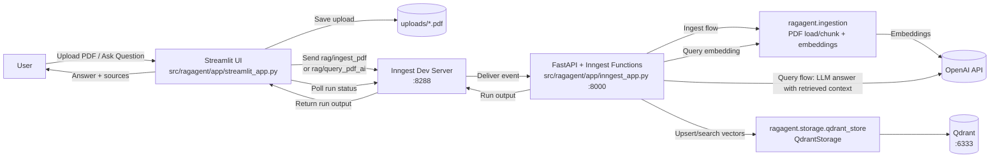
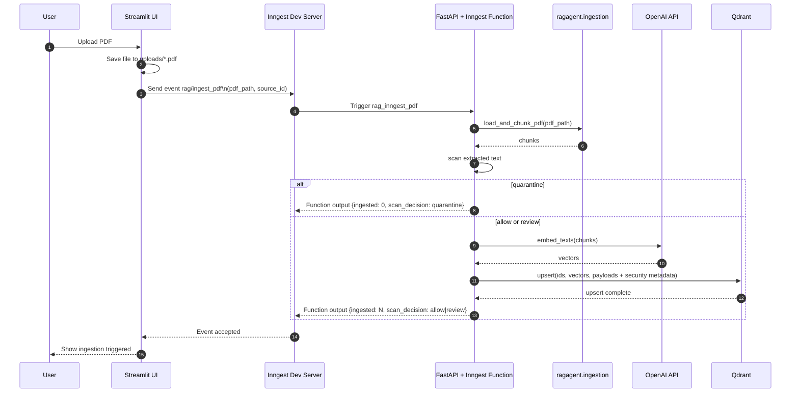
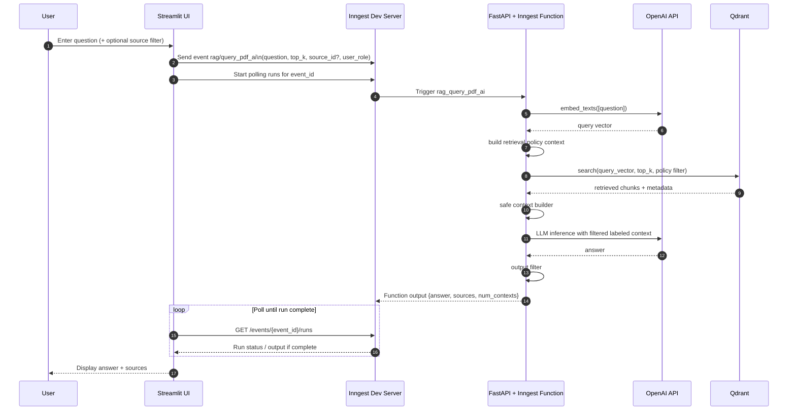

# Runtime Diagrams

These diagrams show the current end-to-end runtime shape of SecureRAGPipeline in more detail than the top-level README figure.

## Architecture Overview

## Ingestion Sequence

## Query Sequence

